<!--
Hey, thanks for using the awesome-readme-template template.  
If you have any enhancements, then fork this project and create a pull request 
or just open an issue with the label "enhancement".

Don't forget to give this project a star for additional support ;)
Maybe you can mention me or this repo in the acknowledgements too
-->

  <h1>Readme</h1>


<br />

<!-- Table of Contents -->
# :notebook_with_decorative_cover: Table of Contents

[About the Project](#star2-about-the-project)
<br>
[Screenshots](#camera-screenshots)
<br>
[Tech Stack](#space_invader-tech-stack)
<br>
[Features](#dart-features)
<br>
[Color Reference](#art-color-reference)
<br>
[Environment Variables](#key-environment-variables)
<br>
[Getting Started](#toolbox-getting-started)
<br>
[Prerequisites](#bangbang-prerequisites)
<br>
[Installation](#gear-installation)
<br>
[Running Tests](#test_tube-running-tests)
<br>
[Run Locally](#running-run-locally)
<br>
[Deployment](#triangular_flag_on_post-deployment)
<br>
[Usage](#eyes-usage)
<br>
[Roadmap](#compass-roadmap)
<br>
[Contributing](#wave-contributing)
<br>
[Code of Conduct](#scroll-code-of-conduct)
<br>
[FAQ](#grey_question-faq)
<br>
[License](#warning-license)
<br>
[Contact](#handshake-contact)
<br>
[Acknowledgements](#gem-acknowledgements)
<br>


<div align="center"> 

<!-- About the Project -->
## :star2: About the Project
<h3>In the beginning, I want to say I created a guide about deploying applications to the Nginx server. There is a lot about correctly configuring and handling environment variables, database config, etc </h3>
Everything is in:
<br>

````
 company_management_app_backend_nest/Guide/MyDevil Hosting Nest...pdf 
 ````

<h3>Backend Repository</h3>

````
https://github.com/PatrykKeska/company_management_app_backend_nest````
````

<br>
The project has separate branches for deployment.
<br>

React:
````
- branch [version_2.0] for localhost
- branch [production] for deployment
````
<br>
<br>
NestJs:

````
- branch [main] for localhost
- branch [deploy] for deployment
 ```` 

Basic Concept of view was created in Figma:
````
https://www.figma.com/file/5TNV2aSijVHNTm0f8phW7u/Projekt-Zaliczeniowy?node-id=0%3A1
````
App is still in development; right now has basic features implemented.<br>
<br>
Check the roadmap to see incoming changes...
Check the features to see implemented functionalities.

<h3>Preview available: https://kendziior4.usermd.net/ </h3>


````
Preview Email: "admin@gmail.com"
````

````
Preview Password: "admin."
````

<!-- Screenshots -->
### :camera: Screenshots

<div>

  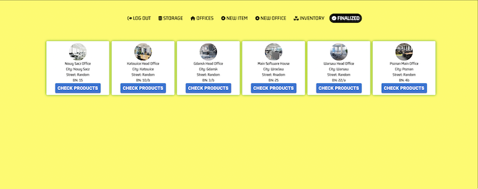
  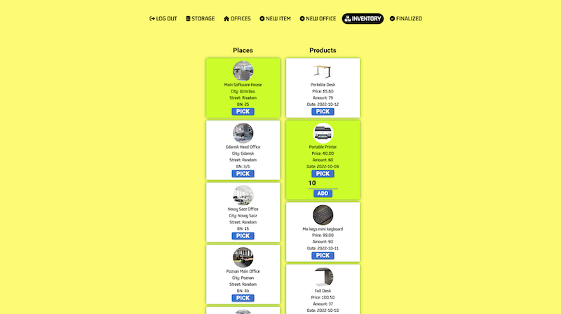
  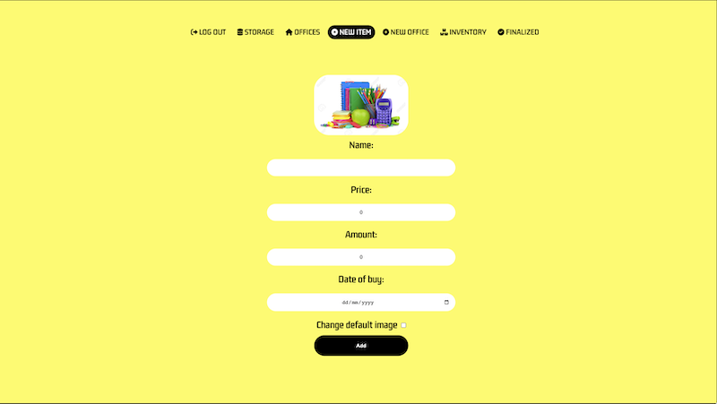
  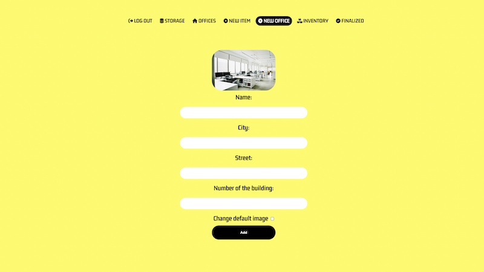
  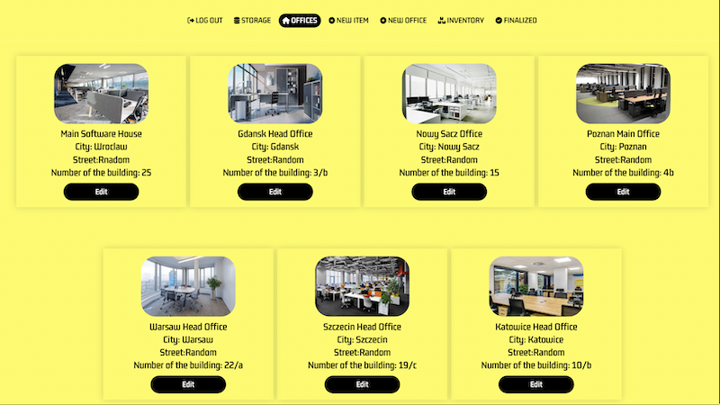
  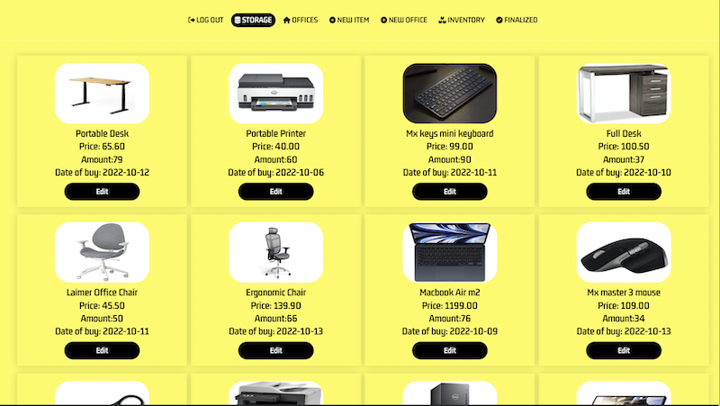
  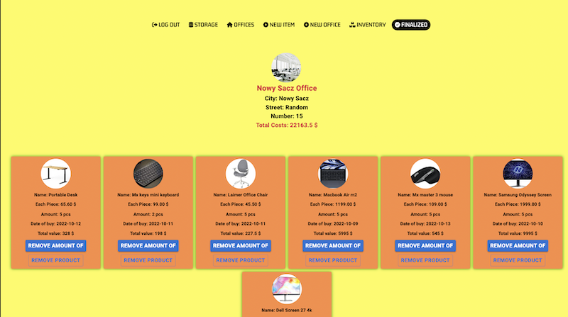
  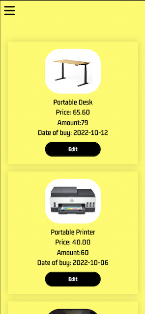
  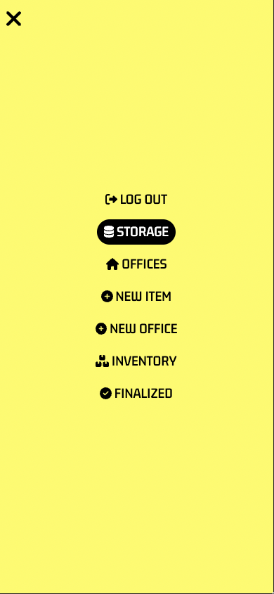
  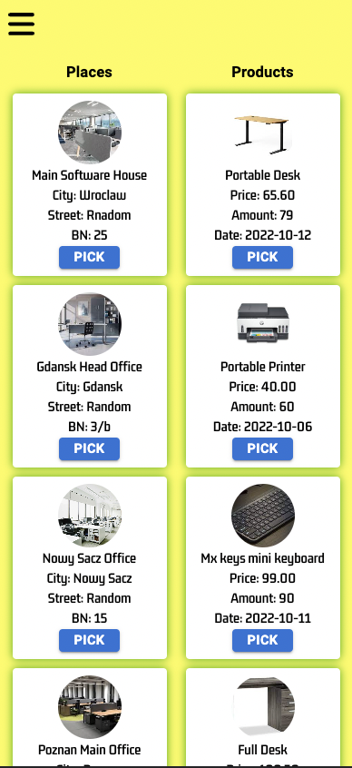
  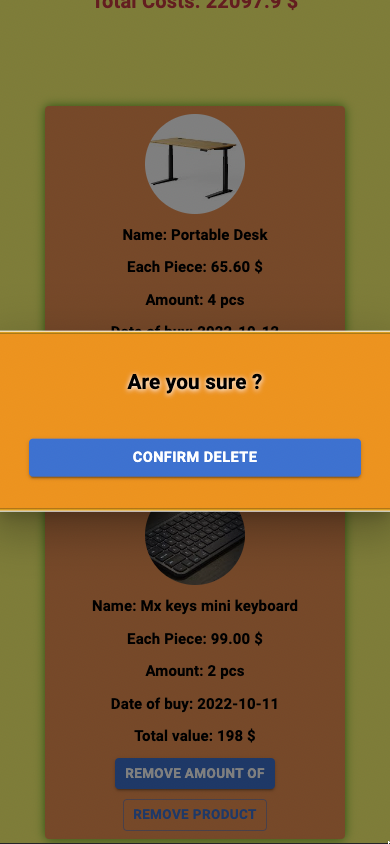

</div>

<!-- TechStack -->
### :space_invader: Tech Stack

<details>
  <summary>Client</summary>
  <ul>
    <li><a href="https://www.typescriptlang.org/">Typescript</a></li>
    <li><a href="https://reactjs.org/">React.js</a></li>
    <li><a href="https://styled-components.com/">Styled-Components</a></li>

  </ul>
</details>

<details>
  <summary>Server</summary>
  <ul>
    <li><a href="https://www.typescriptlang.org/">Typescript</a></li>
    <li><a href="https://nestjs.com/">NestJS</a></li>
    <li><a href="https://typeorm.io/">TypeOrm</a></li>

  </ul>
</details>

<details>
<summary>Database</summary>
  <ul>
    <li><a href="https://www.mysql.com/">MySQL</a></li>
  </ul>
</details>


<!-- Features -->
### :dart: Features

* [x] Login/Logout
* [x] JWT Session
* [x] Safe File Transfer
* [x] User Passwords encryption
* [x] User Registration
* [x] Local Storage Session (Possible to change session time in /utils/isTokenExpire.ts)
* [x] RWD
* [x] Creating a new items.
* [x] Editing items in storage.
* [x] Deleting items from storage.
* [x] Assign items to  office.
* [x] Deleting items from assigned offices.
* [x] Summary of  office.
* [x] Creating of new offices.
* [x] Editing of existing offices.
* [x] Deleting offices
* [x] Keeping up to date all your resources in your offices

Check the Roadmap to find an incoming features!


<!-- Env Variables -->
### :key: Environment Variables

In my guide on the chapter: "Environment variables".<br>
There is more about configuration env variables.
check it out here:
<br>
```` company_management_app_backend_nest/Guide/MyDevil Hosting Nest...pdf ````
<br>
If you want to run a project locally easiest way to do it:
use my secret file scheme and fill up all values according to your database


In this file, you will also find the Salt variable which is responsible for the hashPwd function.
Make sure is long and complicated enough

Also, there is a jwtConstants which also should be unique and complicated

```` src/secretFile.ts````
````
export const dbConnection = {
  DB_CONNECTION: 'mysql',
  DB_HOST: 'localhost',
  DB_USERNAME: 'Database User Name',
  DB_PASSWORD: 'Database User Password',
  DB_DATABASE: 'Database Name',
};

export const SALT = 'Salt for hash pwd';

export const jwtConstants = {
  secret: 'secret for jwt',
};


```` 
</div> 
<div align="center"> 


<h3>To run locally make sure backend is listening and database is implemented correctly. </h3>
<h3>You can check my quick video guide to see how to run the application on your localhost
</h3>

[](http://www.youtube.com/watch?v=X6zKpBCdazU "Localhost Guide")


<h4>I'm working on the multi-user application, so the registry page on the frontend app is disabled.</h4>

After the project runs, please click the button "create default account"
<br>
you are able to use the account :

````
email: admin@gmail.com
password: admin
````

<h3>ATTENTION!
This is crucial to remove this endpoint when you deploy the app!
It is a temporary solution to an easy start with a project locally. </h3>


<!-- Getting Started -->
## 	:toolbox: Getting Started

<!-- Prerequisites -->
### :bangbang: Prerequisites

This project uses Yarn as package manager

```bash
 npm install --global yarn
```

<!-- Installation -->
### :gear: Installation

Install my-project with npm

```bash
  yarn install my-project
  cd my-project
```


<!-- Run Locally -->
### :running: Run Locally

Clone the project

```bash
  git clone https://github.com/PatrykKeska/company_management_app_backend_nest.git
```

Go to the project directory

```bash
  cd company_management_app_backend_nest
```

Install dependencies

```bash
  yarn install
```

Start the server

```bash
  yarn start:dev
```


<!-- Deployment -->
### :triangular_flag_on_post: Deployment

To deploy this project run

```bash
  yarn build
```


<!-- Usage -->
## :eyes: Usage

App can be used as your own managing tool to help you out  sort and keep up to date your company assets in local offices etc.
This is basic concept and still lot of features has to be implemented.


<!-- Roadmap  -->
## :compass: Roadmap

* [x] ~~Linux Server Host Preview~~
* [x] ~~JWT session~~
* [x] ~~File transfer from Client=>Server and reverse~~
* [x] ~~Backend in NestJS~~
* [x] much more user-friendly interface
* [x] better UX/UI
* [x] multi-user platform
* [x] email registration


<!-- License -->
## :warning: License

Distributed under the no License. See LICENSE.txt for more information.


<!-- Contact -->
## :handshake: Contact

Reach me on Twitter - [@twitter_handle](https://twitter.com/Patryk09676751) <br>
Reach me on LinkedIn - [@linkedin_handle](https://www.linkedin.com/in/patryk-keska-992a71250/) <br>
Reach me by email - PatrykKeska4@gmail.com

</div>

